# TOGAF Architecture Documentation

## Document Control
- **Project**: server-go-ssp-redishoard
- **Version**: 1.0.0
- **Date**: 2025-01-18
- **Framework**: TOGAF 9.2
- **Repository**: https://github.com/dxcSithLord/server-go-ssp-redishoard

---

## Executive Summary

This document provides a TOGAF-compliant architecture view of the **server-go-ssp-redishoard** project, mapping business objectives to functional requirements, technical implementations, and deployment architecture.

**TOGAF Architecture Domains Covered**:
1. **Business Architecture** - Business objectives and requirements
2. **Data Architecture** - Data models and flows
3. **Application Architecture** - Component interactions
4. **Technology Architecture** - Platform and infrastructure

---

## Business Architecture

### Business Objectives → Functional Requirements Mapping

```mermaid
graph TD
    %% Business Objectives
    BO1[BO-1: Enable Passwordless Authentication]
    BO2[BO-2: Protect Sensitive Authentication Data]
    BO3[BO-3: Prevent Replay Attacks]
    BO4[BO-4: Production Readiness]

    %% Functional Requirements
    FR1.1[FR-1.1: Save Operation]
    FR1.2[FR-1.2: Get Operation]
    FR1.3[FR-1.3: GetAndDelete Operation]
    FR2.1[FR-2.1: Nut Validation]
    FR3.1[FR-3.1: Secure Memory Clearing]
    FR3.2[FR-3.2: Platform-Specific Memory Locking]

    %% Non-Functional Requirements
    NFR1[NFR-1: Performance &lt;10ms]
    NFR2[NFR-2: Horizontal Scalability]
    NFR3[NFR-3: Security Compliance]
    NFR4[NFR-4: Reliability]
    NFR5[NFR-5: Maintainability]

    %% Relationships
    BO1 --> FR1.1
    BO1 --> FR1.2
    BO1 --> FR1.3
    BO1 --> NFR1
    BO1 --> NFR2

    BO2 --> FR3.1
    BO2 --> FR3.2
    BO2 --> NFR3

    BO3 --> FR1.3
    BO3 --> FR2.1

    BO4 --> NFR4
    BO4 --> NFR5

    %% Styling
    classDef businessObj fill:#e1f5ff,stroke:#01579b,stroke-width:2px
    classDef functionalReq fill:#f3e5f5,stroke:#4a148c,stroke-width:2px
    classDef nonfunctionalReq fill:#fff3e0,stroke:#e65100,stroke-width:2px

    class BO1,BO2,BO3,BO4 businessObj
    class FR1.1,FR1.2,FR1.3,FR2.1,FR3.1,FR3.2 functionalReq
    class NFR1,NFR2,NFR3,NFR4,NFR5 nonfunctionalReq
```

---

## Application Architecture

### Component Interaction Diagram

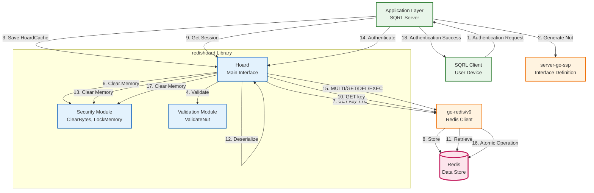

---

## Data Architecture

### Data Flow Diagram: Save Operation

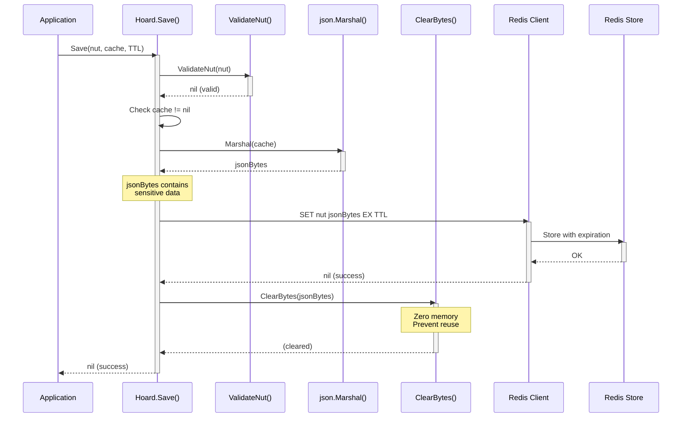

### Data Flow Diagram: GetAndDelete Operation (Atomic)

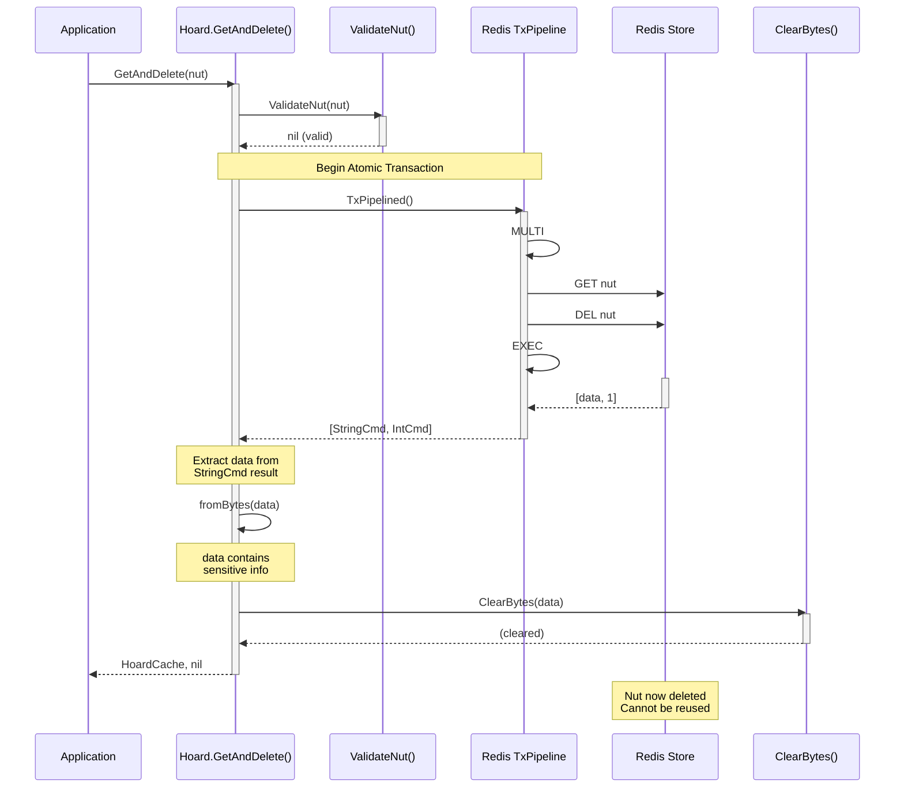

### Data Model: HoardCache Structure

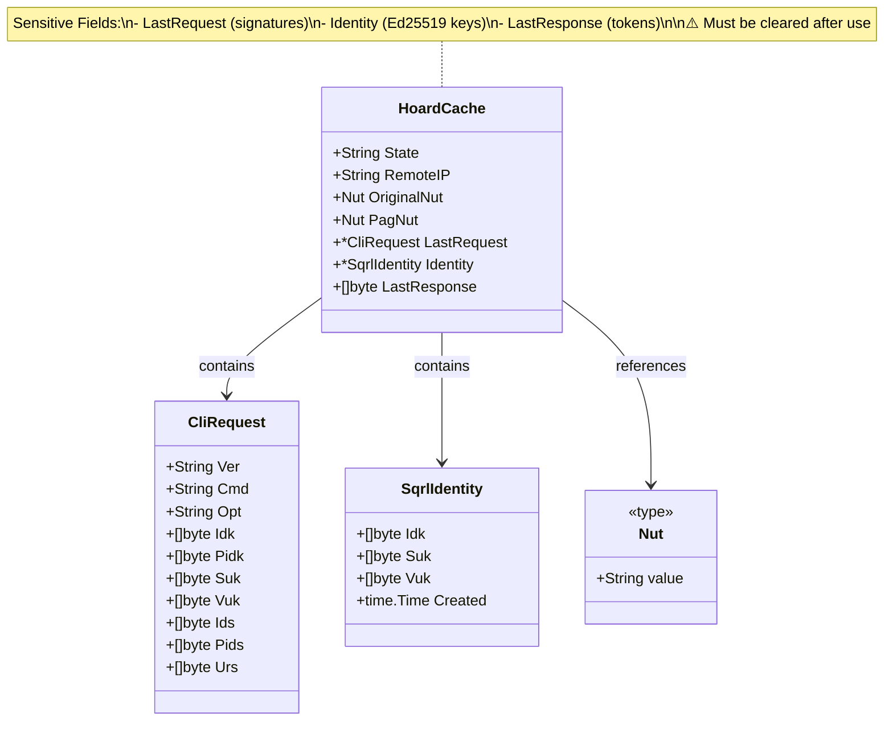

### Redis Key Schema

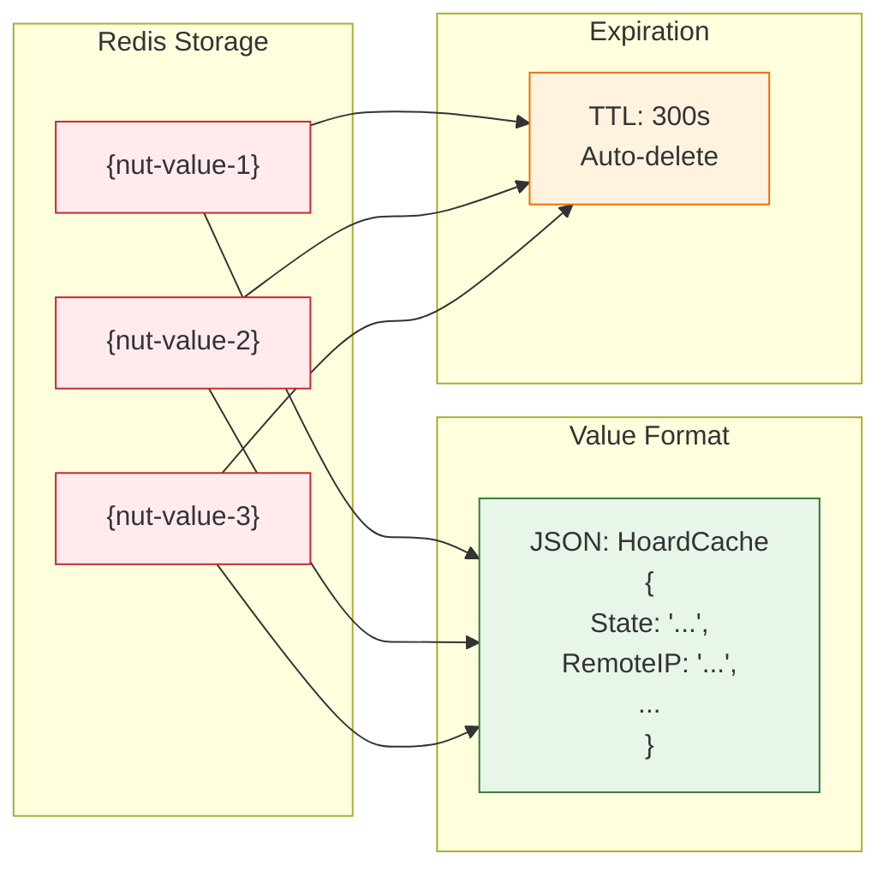

---

## Technology Architecture

### Deployment Architecture: Single Redis Instance

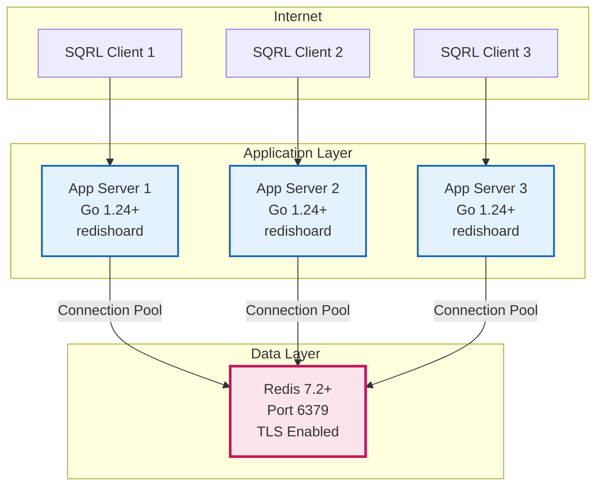

### Deployment Architecture: Redis Cluster (High Availability)

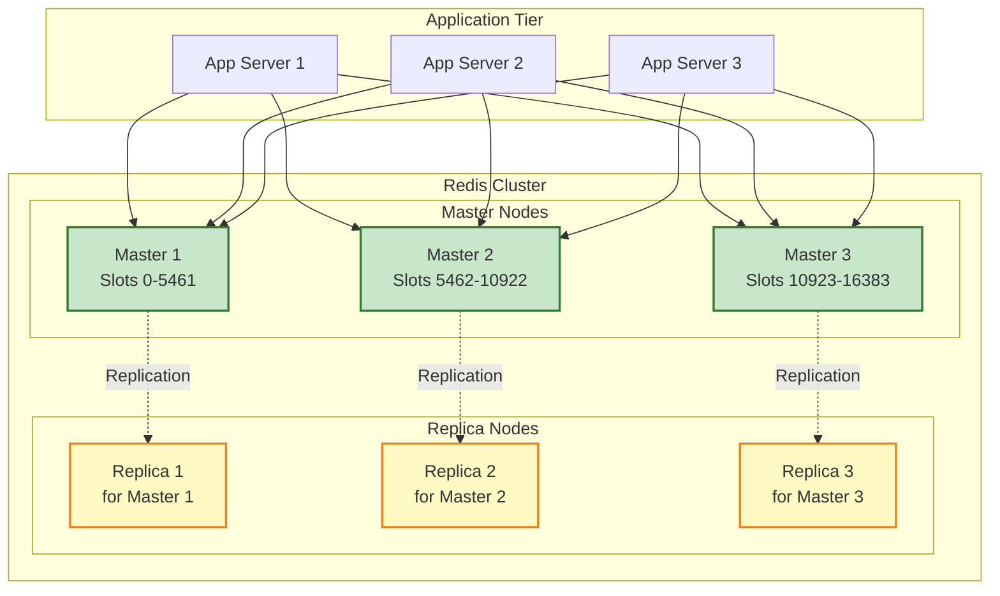

### Platform Architecture: Build Targets

```mermaid
graph TB
    subgraph "Source Code"
        GO[Go Source<br/>hoard.go<br/>secure.go]
    end

    subgraph "Build Tags"
        UNIX[secure_unix.go<br/>//+build unix]
        WIN[secure_windows.go<br/>//+build windows]
        OTHER[secure_other.go<br/>//+build !unix,!windows]
    end

    subgraph "Target Platforms"
        LINUX[Linux<br/>amd64, arm64<br/>mlock()]
        MACOS[macOS<br/>amd64, arm64<br/>mlock()]
        WINDOWS[Windows<br/>amd64<br/>VirtualLock()]
        FREEBSD[FreeBSD<br/>amd64<br/>No locking]
    end

    GO --> UNIX
    GO --> WIN
    GO --> OTHER

    UNIX --> LINUX
    UNIX --> MACOS
    WIN --> WINDOWS
    OTHER --> FREEBSD

    style GO fill:#e8f5e9,stroke:#2e7d32,stroke-width:2px
    style UNIX fill:#e3f2fd,stroke:#1565c0,stroke-width:2px
    style WIN fill:#e3f2fd,stroke:#1565c0,stroke-width:2px
    style OTHER fill:#e3f2fd,stroke:#1565c0,stroke-width:2px
```

---

## Security Architecture

### Threat Model and Mitigations

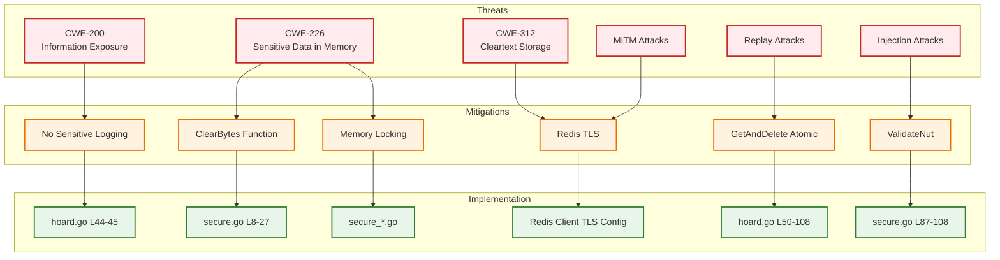

---

## Capability Architecture

### Functional Capabilities Matrix

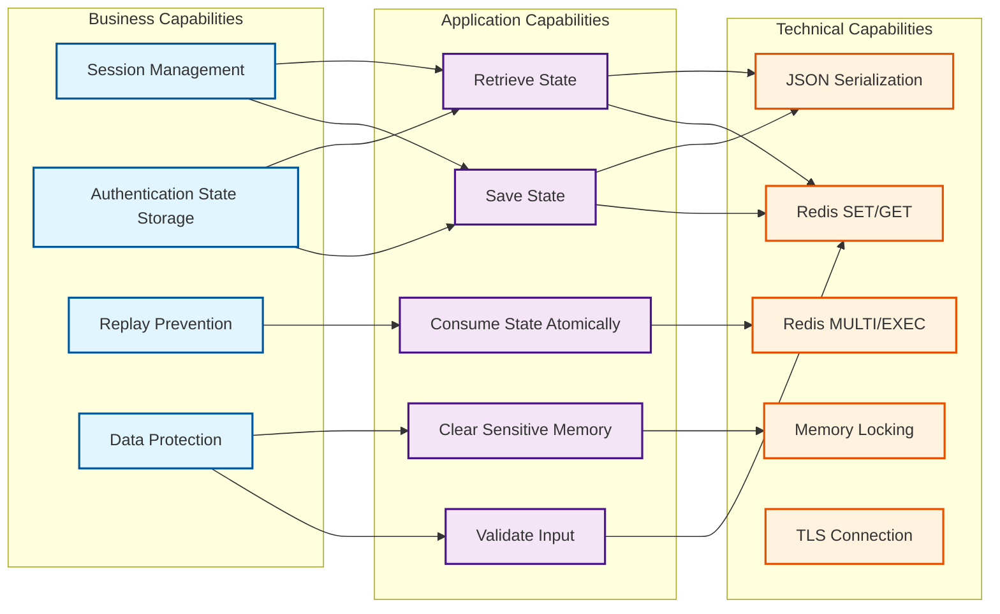

---

## Migration and Transformation Architecture

### Roadmap: Current State → Future State

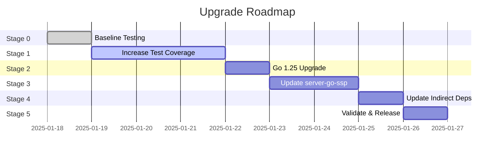

### Transformation Architecture: Go 1.24 → Go 1.25

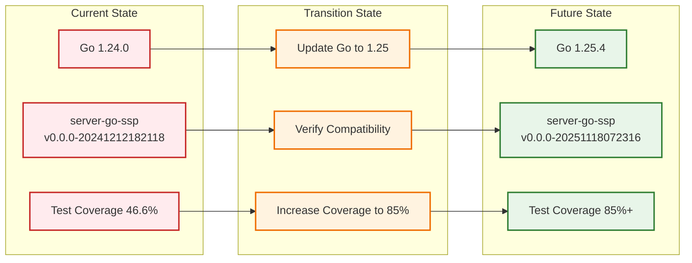

---

## Governance and Compliance

### Architecture Principles Compliance

| Principle | Requirement | Implementation | Status |
|-----------|-------------|----------------|--------|
| **Security by Design** | All sensitive data cleared | ClearBytes(), LockMemory() | ✅ Compliant |
| **Fail-Safe Defaults** | Graceful degradation | Memory locking optional | ✅ Compliant |
| **Least Privilege** | No root required | Best-effort memory locking | ✅ Compliant |
| **Defense in Depth** | Multiple security layers | Validation + Clearing + Locking | ✅ Compliant |
| **Open Standards** | Use SQRL protocol | Implements ssp.Hoard | ✅ Compliant |
| **Separation of Concerns** | Modular design | Hoard / Secure / Validate modules | ✅ Compliant |

### Regulatory Compliance Matrix

| Regulation | Control | Implementation | Evidence |
|------------|---------|----------------|----------|
| **GDPR** (PII Protection) | Art. 32 Security | ClearBytes() | secure.go L8-27 |
| **PCI-DSS** (if handling payment) | Req 3.4 Cryptographic Storage | TLS + Memory Clearing | Redis TLS Config |
| **HIPAA** (if healthcare) | § 164.312(a)(2)(iv) Encryption | TLS Transport | Documentation |
| **SOC 2** (Trust Services) | CC6.1 Logical Access | Input Validation | ValidateNut() |

---

## References

### TOGAF Documentation

- **TOGAF 9.2 Standard**: https://www.opengroup.org/togaf
- **Architecture Development Method (ADM)**: Applied in planning
- **Architecture Building Blocks (ABBs)**: Hoard interface, Security module
- **Solution Building Blocks (SBBs)**: Redis client, Go stdlib

### Project Documentation

- [Requirements](REVERSE_ENGINEERED_REQUIREMENTS.md)
- [Security Plan](SECURITY_PLAN.md)
- [Dependency Analysis](DEPENDENCY_ANALYSIS.md)
- [API Reference](API_REFERENCE.md)

---

## Change Log

| Date | Version | Changes |
|------|---------|---------|
| 2025-01-18 | 1.0.0 | Initial TOGAF architecture documentation with mermaid diagrams |
